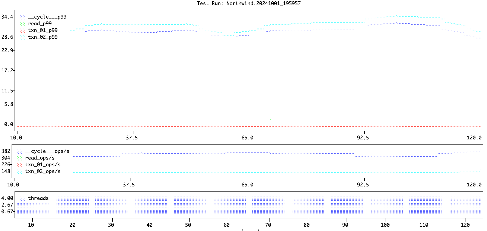

# Corckroachdb-dbworkload Enablement Exercise.

## Install dbworkload.

If you have installed different versions of Python from various sources, including Homebrew, the Official Installer, and Conda then the package manager (pip) will try to resolve the dependency conflict for you and install the most suitable version instead. The example below shows I am using a the anaconda3 Python binary.

<code>% which python<br>
&nbsp;/opt/anaconda3/bin/python
</code>

If you try to install **dbworkload** ([see github readme.md](https://github.com/fabiog1901/dbworkload/blob/main/README.md#1-psycopg-postgresql-cockroachdb)) you will get an error. In Python, different versions of the same library don’t coexist and you might run into a challenge during the installation.

**[Pyenv](https://realpython.com/intro-to-pyenv/)** makes it easier to install different versions of python and quickly switch between them. It can also be integrated with virtual environment tools like virtualenv using a plugin that allows you to create and manage a virtual environment specific to each installed Python version.

Once you have **pyenv** you can install multiple versions of Python. The **pyenv versions** command shows which versions of Python are available.

<code>% pyenv versions<br>
\* system<br>
3.12.2<br>
pypy3.10-7.3.15<br>
pypy3.10-7.3.15/envs/mt_app
</code>

To install a new virtual environment using one of those versions and give it a name you can run pyenv like this: 

<code>pyenv virtualenv 3.12.2 dbworkload</code>

The newly created virtual evironment should be listed in the output of the **pyenv versions** command:

<code>
% pyenv versions<br>
&nbsp;system<br>
&nbsp;3.12.2<br>
&nbsp;3.12.2/envs/dbworkload<br>
\* dbworkload --> /Users/ainfanzon/.pyenv/versions/3.12.2/envs/dbworkload (set by /Users/ainfanzon/dbworkload/.python-version)<br>
&nbsp;mt_app --> /Users/ainfanzon/.pyenv/versions/pypy3.10-7.3.15/envs/mt_app<br>
&nbsp;pypy3.10-7.3.15<br>
&nbsp;pypy3.10-7.3.15/envs/mt_app
</code>

<p>Now you should be able to install dbworkload using pyenv:

```% pyenv exec pip install "dbworkload[postgres]"```<br>
```% pyenv exec pip install psycopg```

and execute the **dbworklod** command:

<code>% dbworkload<br>
 Usage: dbworkload [OPTIONS] COMMAND [ARGS]...<br>
 dbworkload v0.4.1: DBMS workload utility.<br>
 <br>
╭─ Options ────────────────────────────────────────────────────────────────────────────────────────╮<br>
│ --version             -v        Print the version and exit                                       │<br>
│ --install-completion            Install completion for the current shell.                        │<br>
│ --show-completion               Show completion for the current shell, to copy it or customize   │<br>
│                                 the installation.                                                │<br>
│ --help                          Show this message and exit.                                      │<br>
╰──────────────────────────────────────────────────────────────────────────────────────────────────╯<br>
╭─ Commands ───────────────────────────────────────────────────────────────────────────────────────╮<br>
│ run                   Run the workload.                                                          │<br>
│ util                  Various utils.                                                             │<br>
╰──────────────────────────────────────────────────────────────────────────────────────────────────╯<br>
<br>
See GitHub: <https://github.com/fabiog1901/dbworkload></code> for the installation details.

## Clone the CRDB Northwind GitHub repository.

The repository can be found in the below GitHub page:

```
% git clone https://github.com/ainfanzon/Cockroachdb-dbworkload
```

## Deploy in localhost.

Start a CRDB cluster and execute the following steps to create the **northwind** database and the tables.

### Step 1: Start a the Python server

Open a new terminal then start a simple python server:

```
cd <DOWNLOAD DIR>/Cockroachdb-dbworkload/data<br>
python3 -m http.server 3000
```

### Step 2: Create database and populate the tables

Execute the sql script to create and populate the tables.

```
% cockroach sql --url "postgres://root@localhost:26257/defaultdb?sslmode=disable" --user root --database defaultdb --insecure --file <DOWNLOAD DIR>/Cockroachdb-dbworkload/crdb_northwind.sql
```

### Step 3: Execute the workload

Execute the Python class with the test workload

```
%  dbworkload run -w northwind.py -s -c 4 --uri 'postgres://root@localhost:26257/northwind?sslmode=disable' -d 120 -i 100000
```


|     |    |
|-------------|-------------------------|
|run_name|Northwind.20241001_223012|
|start_time|2024-10-01 22:30:12|
|end_time|2024-10-01 22:32:12|
|test_duration|120|


|elapsed|id|threads|tot_ops|tot_ops/s|mean(ms)|p50(ms)|p90(ms)|p95(ms)|p99(ms)|max(ms)|
|---|---|---|---|---|---|---|---|---|---|---|
|120|__cycle__|4|19,879|165|23.85|21.25|50.50|52.73|57.21|116.26|
|120|read|4|9,889|82|0.65|0.60|0.95|1.08|1.48|16.43|
|120|txn_01|4|9,990|83|0.02|0.02|0.03|0.03|0.05|0.20|
|120|txn_02|4|9,990|83|22.55|22.37|26.07|27.27|30.66|84.05|
|120|txn_03|4|9,990|83|24.25|23.99|28.11|29.43|32.80|85.19|


|Parameter|Value|
|----|----|
|workload_path|/Users/ainfanzon/dbworkload/northwind.py|
|conn_params|{'conninfo': 'postgres://root@localhost:26257/northwind?sslmode=disable&application_name=Northwind', 'autocommit': True}|
|conn_extras|{}|
|concurrency|4|
|duration|120|
|iterations|100000|
|ramp|0|
|args|{}|

Produce a plot:

```
% dbworkload util plot -i Northwind.20241001_195957.csv
```



## Apendix 1: SQL Queries

Query #1:
```
SELECT contact_name
     , company_name
     , contact_title
     , phone
FROM customers```
WHERE customer_id = 'HUNGC'<br>
```
Query #2:
```
SELECT contact_name
FROM customers
WHERE UPPER(contact_title) LIKE '%MANAGER%'
ORDER BY contact_name
LIMIT 10<br>
```
Query #3:
```
SELECT p.product_name
     , SUM(od.unit_price * CAST(od.quantity AS FLOAT) * (1.0 - od.discount)) AS Sales
FROM products AS p INNER JOIN order_details AS od ON od.product_id = p.product_id
GROUP BY p.product_name
ORDER BY Sales DESC LIMIT 5<br>
```
Query #4:
```
INSERT INTO transactions VALUES (%s, %s, %s, %s)
```
